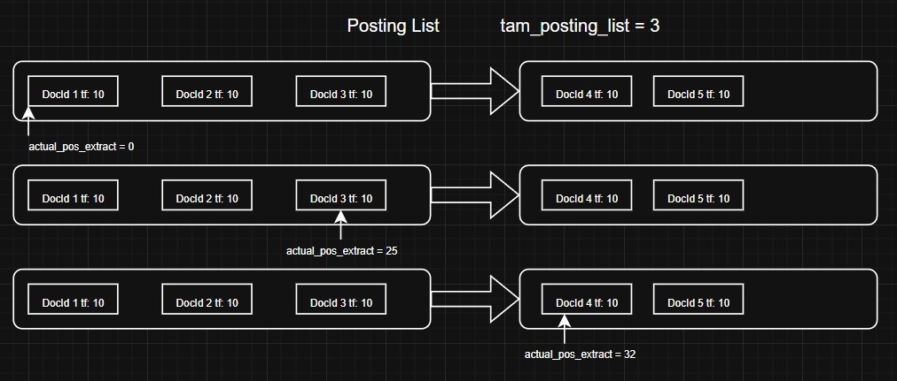
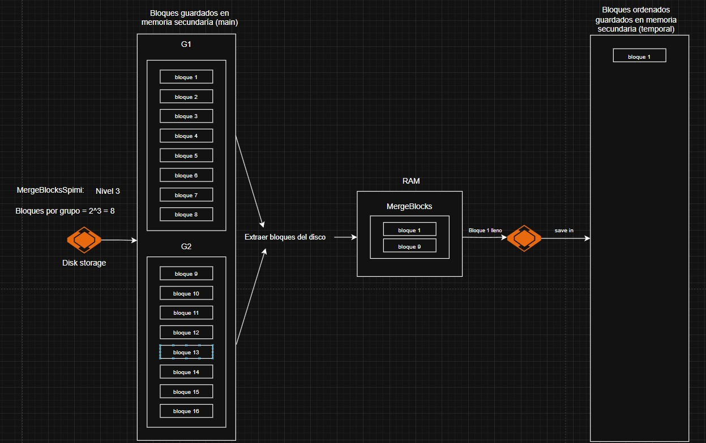
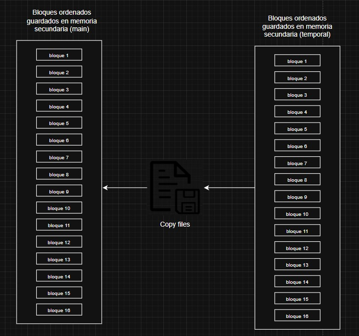
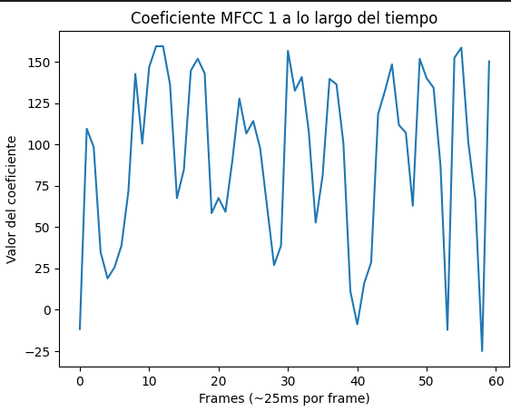
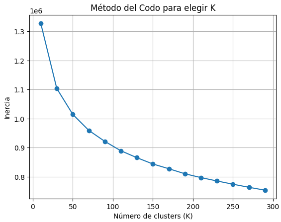

# Supabase Reply - Resumen del Proyecto

Este repositorio contiene una plataforma de gestión y consulta de bases de datos SQL, con funcionalidades de recomendación musical, construida con un backend en Python (FastAPI) y dos frontends en Next.js: uno general y otro especializado en música.

---

## Estructura Principal

- **`server/`**  
  Backend en Python (FastAPI). Expone una API REST para gestión de bases de datos, ejecución de queries SQL y recomendaciones musicales.
- **`pinpom/`**  
  Frontend principal en Next.js. Incluye un editor SQL, visualización de resultados y navegación por proyectos.
- **`app-music/`**  
  Frontend especializado en música, también en Next.js. Permite explorar, buscar y obtener recomendaciones de canciones.
- **`main.py`**  
  Script de ejemplo para pruebas y ejecución directa de lógica SQL y de audio.

---

## 1. Backend (FastAPI)

- Ubicación: [`server/`](server/)
- Arranque principal: [`server/api/main.py`](server/api/main.py)
- Funcionalidades:
  - Gestión de bases de datos, esquemas, tablas y queries SQL.
  - Recomendaciones musicales por similitud de audio.
  - Endpoints principales: `/database`, `/table`, `/schema`, `/query`.

 
### Endpoint principal del backend

El backend expone un único endpoint principal para la interacción con el sistema:

- **POST `/api/query`**  
  Permite enviar consultas SQL y obtener los resultados procesados, incluyendo funcionalidades de búsqueda, gestión de datos y recomendaciones musicales.

**Ejemplo de uso:**
```json
POST /api/query
{
  "query": "SELECT * FROM canciones WHERE genero = 'rock';"
}
``` 

### Instalación y ejecución

```sh
cd server
pip install -r requirements.txt
uvicorn server.api.main:app --reload
```

El backend corre por defecto en [http://127.0.0.1:8000](http://127.0.0.1:8000).

---

## 2. Frontend Principal (Pinpom)

- Ubicación: [`pinpom/`](pinpom/)
- Funcionalidades:
  - Editor SQL interactivo ([`pinpom/app/dashboard/project/[id]/sql/page.tsx`](pinpom/app/dashboard/project/[id]/sql/page.tsx))
  - Navegación por proyectos, visualización de esquemas, tablas y resultados de queries.
  - UI moderna con componentes reutilizables.

### Instalación y ejecución

```sh
cd pinpom
pnpm install   # o npm install / yarn install
pnpm dev       # o npm run dev / yarn dev
```

Accede a [http://localhost:3000](http://localhost:3000).

---

## 3. Frontend Música (App Music)

- Ubicación: [`app-music/`](app-music/)
- Funcionalidades:
  - Exploración y búsqueda de canciones.
  - Visualización de detalles, géneros, autores y recomendaciones musicales.
  - UI optimizada para música.

### Instalación y ejecución

```sh
cd app-music
pnpm install   # o npm install / yarn install
pnpm dev       # o npm run dev / yarn dev
```

Accede a [http://localhost:3000](http://localhost:3000).

---

## 4. SQL y Dataset

- Los scripts y queries SQL de ejemplo están en [`main.py`](main.py).
- Los datasets musicales se encuentran en `server/utils/dataset/`.
- El backend soporta operaciones SQL como `CREATE`, `SELECT`, `COPY`, `DELETE`, etc.

---

## Métodos importantes implementados 

### SPIMI (Single-Pass In-Memory Indexing)

**Descripción:**  
El backend implementa un índice invertido usando el algoritmo SPIMI, adaptado para funcionar eficientemente en memoria secundaria. Este índice permite búsquedas rápidas y eficientes sobre grandes volúmenes de texto, como letras de canciones o descripciones.

**Estructura del proceso de indexación:**
- **Preprocesamiento:**  
  Se aplica tokenización, stemming y eliminación de stopwords para obtener solo las palabras relevantes de cada documento (tokens).
- **Posting List:**  
  Cada token mantiene una lista de documentos donde aparece. Se limita el tamaño de cada lista para optimizar el uso de memoria.
- **Bloques:**  
  Los tokens y sus posting lists se agrupan en bloques. Cuando un bloque se llena, se guarda en disco y se crea uno nuevo.

**Construcción y ordenamiento:**  
- El índice se construye en dos etapas: primero se crean los bloques y luego se realiza un merge ordenado de estos, asegurando que los tokens queden ordenados globalmente.
- Se utilizan algoritmos eficientes para fusionar bloques y mantener la estructura enlazada de las posting lists.

**Consultas y recuperación:**  
- Se soportan consultas por similitud de coseno (TF-IDF) usando el modelo k-NN, devolviendo los documentos más similares a la consulta.
- También se implementan operadores booleanos (AND, OR, AND NOT) para búsquedas lógicas.
- Para acelerar la búsqueda, se usa búsqueda binaria sobre los bloques ordenados.

**Heurística de hiperparámetros:**  
- El sistema ajusta automáticamente los tamaños de bloque y posting list según las características de los datos, buscando un equilibrio entre eficiencia y uso de memoria.

**Integración con el backend:**  
- El índice se crea desde el backend con un comando tipo:
  ```sql
  CREATE INDEX nombre_index ON table_name USING SPIMI(atribute_name);
  ```
  El índice se almacena en disco bajo la ruta `./tabla_nombre/atributo_nombre`.

**Notas adicionales:**  
- El índice almacena información adicional como la frecuencia de documentos (df) y la longitud de cada documento, necesarios para el cálculo de similitud.
- Si el índice ya existe, se reutiliza para nuevas consultas sin necesidad de reconstruirlo.

**Imágenes:**  
_Agrega aquí diagramas del proceso de indexación, ejemplos de bloques, o capturas de consultas sobre el índice### SPIMI (Single-Pass In-Memory Indexing)


**Descripción:**  
El backend implementa un índice invertido usando el algoritmo SPIMI, adaptado para funcionar eficientemente en memoria secundaria. Este índice permite búsquedas rápidas y eficientes sobre grandes volúmenes de texto, como letras de canciones o descripciones.

**Estructura del proceso de indexación:**
- **Preprocesamiento:**  
  Se aplica tokenización, stemming y eliminación de stopwords para obtener solo las palabras relevantes de cada documento (tokens).
- **Posting List:**  
  Cada token mantiene una lista de documentos donde aparece. Se limita el tamaño de cada lista para optimizar el uso de memoria.
- **Bloques:**  
  Los tokens y sus posting lists se agrupan en bloques. Cuando un bloque se llena, se guarda en disco y se crea uno nuevo.

**Construcción y ordenamiento:**  
- El índice se construye en dos etapas: primero se crean los bloques y luego se realiza un merge ordenado de estos, asegurando que los tokens queden ordenados globalmente.
- Se utilizan algoritmos eficientes para fusionar bloques y mantener la estructura enlazada de las posting lists.

**Consultas y recuperación:**  
- Se soportan consultas por similitud de coseno (TF-IDF) usando el modelo k-NN, devolviendo los documentos más similares a la consulta.
- También se implementan operadores booleanos (AND, OR, AND NOT) para búsquedas lógicas.
- Para acelerar la búsqueda, se usa búsqueda binaria sobre los bloques ordenados.

**Heurística de hiperparámetros:**  
- El sistema ajusta automáticamente los tamaños de bloque y posting list según las características de los datos, buscando un equilibrio entre eficiencia y uso de memoria.

**Integración con el backend:**  
- El índice se crea desde el backend con un comando tipo:
  ```sql
  CREATE INDEX nombre_index ON table_name USING SPIMI(atribute_name);
  ```
  El índice se almacena en disco bajo la ruta `./tabla_nombre/atributo_nombre`.

**Notas adicionales:**  
- El índice almacena información adicional como la frecuencia de documentos (df) y la longitud de cada documento, necesarios para el cálculo de similitud.
- Si el índice ya existe, se reutiliza para nuevas consultas sin necesidad de reconstruirlo.

### Imágenes explicativas del proceso SPIMI

1. **Ejemplo de actually pos extract**  
     
   *Esta imagen muestra cómo se lleva el control de la posición actual de extracción (`actual_pos_extract`) en una posting list durante el proceso de merge. Permite retomar la extracción exactamente donde se dejó, asegurando que no se pierda información ni se dupliquen documentos al fusionar bloques.*

2. **Ejemplo del algoritmo del merge**  
     
   *Aquí se ilustra el funcionamiento del algoritmo de merge entre bloques. Se observa cómo se comparan los tokens de dos bloques ordenados y se fusionan en un nuevo bloque, manteniendo el orden lexicográfico y la estructura enlazada de las posting lists.*

3. **Copia de archivos temporales a archivos principales**  
     
   *Esta imagen representa el paso final del proceso de merge, donde los bloques temporales generados durante la fusión se copian al directorio principal. Así se asegura que el índice final quede almacenado de forma ordenada y lista para consultas eficientes.*

### Descriptores de Audio

**Descripción:**  
La indexación invertida para descriptores locales permite asociar eficientemente características acústicas de los audios con sus identificadores, facilitando búsquedas y recomendaciones musicales basadas en contenido.  
En este proyecto, se trabajó con 2913 audios en formato WAV, procesando los primeros 30 segundos de cada pista.

**Proceso principal:**

1. **Extracción de MFCC:**  
   Se utilizan los coeficientes MFCC (Mel-Frequency Cepstral Coefficients) para representar el timbre y la forma espectral de cada audio. Cada audio se transforma en una matriz de MFCC usando la librería `librosa`.

     
   *Visualización de la forma de onda de un audio antes del procesamiento.*

     
   *Ejemplo de la evolución del primer coeficiente MFCC a lo largo del tiempo.*

2. **Bag of Acoustic Words:**  
   Los descriptores MFCC de todos los audios se apilan y se agrupan mediante clustering (K-Means), formando un "diccionario acústico" de palabras representativas.

3. **Normalización y K-Means:**  
   Los MFCC se normalizan con `StandardScaler` y se agrupan en clusters usando K-Means. El número óptimo de clusters se determina con el método del codo.

     
   *Gráfico del método del codo para seleccionar el número óptimo de clusters en K-Means.*

4. **Generación de histogramas acústicos:**  
   Cada audio se representa como un histograma de frecuencias de "Acoustic Words" (clusters), lo que permite comparar y recomendar canciones por similitud de contenido.

## Notas de Ejecución

Para ejecutar correctamente la aplicación, se recomienda configurar un entorno virtual para el backend y utilizar Python 3.13. Además, es necesario tener instalado `ffmpeg` y contar con `pnpm` como gestor de paquetes para el frontend.

### Requisitos

#### Backend:
- Python 3.13 (o versión compatible)
- `ffmpeg` instalado en el sistema
- Entorno virtual (`venv`)

#### Frontend:
- `pnpm` instalado globalmente


### Pasos para ejecutar

#### Frontend

```bash
cd .\app-music\
pnpm install
pnpm run dev
```

#### Backend

```bash
# Crear entorno virtual
py -m venv venv

# Activar entorno virtual (en PowerShell)
.\venv\Scripts\Activate.ps1

# Instalar dependencias
pip install -r .\server\requirements.txt

# Ejecutar la aplicación
uvicorn server.api.main:app
```

## Créditos

- Backend: FastAPI, SQLGlot, lógica personalizada.
- Frontend: Next.js, shadcn/ui, TailwindCSS.
- Inspirado en plataformas de gestión de bases de datos y exploradores musicales.

